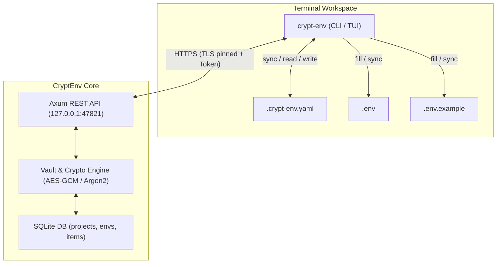
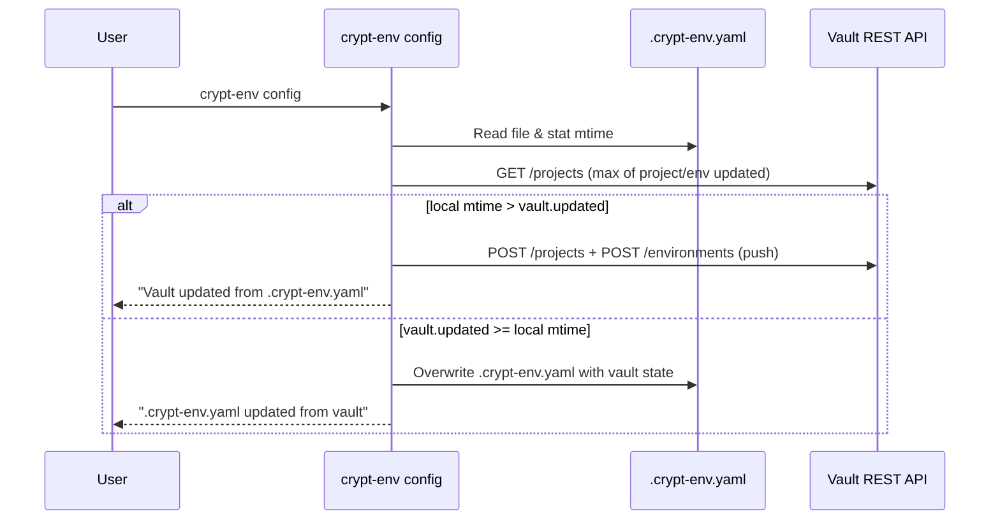

# Technical Design: CLI, REST, and TUI Parity & Project Workflow Alignment

## Context

CryptEnv provides a local-first encrypted vault accessible via desktop GUI, REST API (`127.0.0.1:47821`), CLI, and TUI. While the GUI has rich project and environment management, the CLI previously used an ad-hoc set of subcommands and a rudimentary `crypt-env.json` descriptor. Developers working in terminal-first workflows need seamless project initialization, configuration synchronization, collision detection, and secret injection with cryptographic safety.

See [proposal.md](proposal.md) for background and motivation.

## Goals / Non-Goals

**Goals:**
- Provide direct CLI subcommands (`init`, `config`, `add`, `fill`, `sync`, `inject`, `search`, `doctor`, `setup wsl`) that achieve operational parity with GUI project management.
- Establish `.crypt-env.yaml` as the human-readable project manifest in workspace repositories.
- Implement bidirectional metadata synchronization (`config`) with conflict resolution using file mtime vs vault `updated` timestamp.
- Protect all secret decryption and materialization operations behind master password verification with volatile memory zeroization.
- Support interactive collision resolution in `add` with password-protected inspection.
- Modernize `crypt-env tui` with `ratatui` to offer keyboard-driven parity with these workflows.
- Remove unsupported legacy commands entirely.

**Non-Goals:**
- Storing unencrypted secrets inside `.crypt-env.yaml`.
- Implementing background remote synchronization without user command invocation.
- Re-architecting the database schema: reuse existing `projects`, `environments`, `environment_vars`, and `items` tables.

## Architecture & Data Flow



### Command Flow & Precedence



## Decisions

### 1. Project Descriptor: `.crypt-env.yaml`
- **Decision**: `.crypt-env.yaml` lives at the **project root** (the directory it is in *is* the root). Schema (revised 2026-09-27, see Decision 8 — the project-level `paths` list was dropped):
  ```yaml
  # Managed by crypt-env. Contains NO secret values — safe to commit.
  project:
    name: my-service
    description: Backend authentication service
    categories:
      - backend
      - rust
    environments:
      - name: default
        isDefault: true
        paths:
          - .env
      - name: production
        isDefault: false
        paths:
          - apps/api/.env.production
  ```
- Environment `paths` are relative to the YAML's directory (preferred) or absolute.
- The serde model lives in the shared library (`src-tauri/src/project/manifest.rs`) so the CLI (`init`/`config`) and the GUI (`project_write_yaml`) emit byte-identical files.
- **Rationale**: YAML is human-readable, allows comments, and can be reviewed or edited without launching the GUI.
- **Alternatives Considered**: JSON (`crypt-env.json`). Rejected because JSON lacks comment support and is less ergonomic for manual developer editing. Backward compatibility: if `crypt-env.json` is found and `.crypt-env.yaml` is absent, scope resolution still reads its `project`/`environment`, prints a one-line migration notice, and `crypt-env init` uses its project name as the default `NAME`.

### 2. Bidirectional `config` Synchronization & Precedence
- **Decision**: Precedence is decided by timestamp comparison:
  - Local timestamp: `.crypt-env.yaml` mtime.
  - Remote timestamp: `max(project.updated, environments[*].updated)` from `GET /projects` (unix seconds). Environment edits do not bump `project.updated`, so the max is required.
  - Project lookup is by name (the YAML is committed and shared; vault ids are machine-local).
  - Local newer → **push**: `POST /projects` (existing id, name/description/categories, `rootPath` = YAML directory as the host sees it) then `POST /environments` per YAML environment (matched by name, existing `vars` preserved). Vault environments absent from the YAML are **not deleted** (they hold secret links) — they are reported, and the next pull restores them in the YAML.
  - Vault newer or equal → **pull**: regenerate the YAML; if the content is unchanged nothing is written ("already in sync"); after writing, the file mtime is set to the remote timestamp to avoid ping-pong.
- There is no `PUT /projects/:id`; `POST /projects` with `id > 0` updates.
- **Rationale**: Simple, intuitive, and requires no central locking server.

### 3. Collision Resolution in `crypt-env add`
- **Decision**:
  1. Inspect target environment (and global scope if `--global`).
  2. If the key exists, abort saving immediately and log:
     `"Error: Key '<KEY>' already exists in environment '<ENV>'. Addition aborted."`
  3. Prompt: `"Do you want to inspect the colliding value? [y/N]: "`
  4. If user inputs `y`, prompt for master password -> authenticate -> fetch and display the colliding value.
- **Rationale**: Prevents accidental overwriting of sensitive keys while providing a secure inspection route to verify why a key cannot be added.

### 4. Password-Gated Actions — per-terminal sliding sessions (revised 2026-09-27)
- **Decision** (user-confirmed): sudo-like. A gated action (`fill`, `sync`, `inject`, `search`, the `add` collision reveal, TUI reveal/fill/sync) prompts for the master password **only when the current terminal has no live CLI session**. Entering it (`POST /unlock`) yields a session token bound to that terminal; each authenticated use within the timeout renews it for another full timeout; once it lapses the next command prompts again.
- **Timeout**: the existing GUI setting `auto_lock_timeout` (minutes, default 5) — no new setting.
- **Server** (`api`): the single `session_token`/`token_expires` slot becomes a bounded map `token → (expires, ttl)`. `verify_token` checks it in constant time per entry and slides `expires = now + ttl` on success; expired entries are pruned on insert; at most 64 live sessions (oldest evicted). Consequence: terminals no longer invalidate each other, and consecutive gated commands stay under the 5-per-minute unlock rate limit.
- **Client**: the token file is per terminal — `<token path>.<id>` where `<token path>` is `CRYPTENV_TOKEN_PATH` or the platform default and `<id>` is the first 16 hex chars of SHA-256 of the terminal identity. Terminal identity: `CRYPTENV_TERMINAL_ID` if set; Unix: session id (`getsid`) + controlling tty + (Linux) the session leader's start time, like sudo's `tty_tickets` — subshells such as `eval "$(crypt-env inject X)"` share it; Windows: the console window handle (unique per Windows Terminal tab). The WSL managed launcher exports `CRYPTENV_TERMINAL_ID` computed in the Linux shell (session id + tty) through `WSLENV`, because interop gives each Windows process a fresh console. Stale token files (unused > 24 h) are deleted opportunistically.
- **Binding is client-side only** (user-confirmed): the server does not see the terminal id. A process running as the same OS user can still read the token files — same trust boundary as the previous single `.cli_token`, strictly narrower in practice.
- Passwords are held in `Zeroizing` buffers and dropped right after `POST /unlock`.
- **Rationale**: removes prompt fatigue for chains of gated commands without making a password-derived credential usable from every terminal.

### 5. Smart WSL Setup (`crypt-env setup wsl [DISTRO]`)
- **Decision**:
  - Detection phase:
    - Check `/proc/version` or `WSL_DISTRO_NAME`. If set, execute current-distro setup directly.
    - If on Windows host: invoke `wsl.exe -l -q` (UTF-16LE decoded).
      - If output is empty or exit code indicates WSL is missing: display `"No WSL distributions found on this system."`
      - If distributions exist and no `[DISTRO]` argument is given: list distributions and instruct: `"Multiple distributions found. Run 'crypt-env setup wsl <distro>' to configure a specific one."`
      - If `[DISTRO]` is provided and valid: apply setup targeting that distribution.
- **Rationale**: Removes ambiguity when multiple distros (e.g. Ubuntu, Debian) exist on Windows.

### 6. Interactive TUI Modernization (`crypt-env tui`)
- **Decision**:
  - Leverage `ratatui` (0.29+) and `crossterm`.
  - Restructure TUI views into:
    1. Project/Environment Navigator.
    2. Variable Explorer (keys visible, values masked by default).
    3. Action Dialogs (`init`, `config`, `fill`, `sync`, `search`).
  - Hotkey `v` triggers password-authenticated unmasking modal.

### 7. Removing Legacy Commands
- **Decision** (confirmed with the user 2026-09-27, revised the same day): `memory`, `list`, `exec`, `cmd`, `project`, `share`, `relay`, `category` and `set` are **deleted entirely** from the CLI binary — no stubs; clap reports them as unrecognized subcommands. Their functionality (sharing, saved commands, categories, project deletion) remains in the desktop GUI. `add`, `fill`, `sync`, `inject`, `search`, `doctor`, `setup` and `tui` are rewritten against this change's spec rather than patched.

### 8. Project Root Path (resolved 2026-09-27)
- **Problem**: the vault had no notion of a project directory — only absolute per-environment file paths, written by the GUI host process. Relative YAML paths had nothing to resolve against.
- **Decision**: additive, nullable column `projects.root_path` (exposed as `rootPath` on `Project`/`ProjectInput`; in `ProjectInput` omitted = keep, `""` = clear). Environment paths may be **relative** (resolved against `rootPath` at inject time, contained within it) or absolute (unchanged legacy behavior). A relative path on a project without a root is a clear error. This supersedes the `gui-project-yaml-paths` non-goal "no schema change".
- **Alternatives**: absolute-only vault paths with YAML-side translation (rejected: GUI cannot resolve relative input later); project-level `paths × env paths` (rejected: ambiguous).

### 9. WSL ↔ Windows Path Representation
- **Decision**: the vault always stores paths **as the GUI host sees them**. A native Linux CLI running inside WSL (`WSL_DISTRO_NAME` set) translates absolute paths with `wslpath -w` when pushing (`/home/u/app` → `\\wsl.localhost\<distro>\home\u\app`) and `wslpath -u` when pulling. Relative environment paths need no translation, which is why they are preferred.

## Security & Threat Model

- **No Plaintext in Logs or File Artifacts**: Neither `.crypt-env.yaml` nor terminal debug output contains unencrypted secrets.
- **Authentication**: All decryption actions require master password validation via constant-time token verification on `127.0.0.1:47821`.
- **Memory Safety**: Passwords entered via terminal prompts are stored in `Zeroizing<String>` or zeroized slices and discarded immediately after session token acquisition.
- **Safe Evaluation for `inject`**: Variable injection produces strict, sanitized shell-compatible variable assignments (e.g. `export KEY='...'`) designed for `eval $(crypt-env inject KEY)` without displaying the decrypted secret on stdout/stderr interactively.
- **Atomic File Writes**: `fill` writes new `.env` files using atomic swap and creates `.bak` backups if replacing unmanaged files.

## Risks & Trade-offs

- **[Risk] Clock skew between local filesystem and database timestamps in `config`**
  → *Mitigation*: Both timestamps are evaluated on the same host machine (since REST API is local-only at `127.0.0.1:47821`).
- **[Risk] User enters incorrect master password during collision check or fill**
  → *Mitigation*: Returns structured error without side effects or corrupted file writes.
- **[Risk] Terminal scrollback leaking secret when inspecting colliding values**
  → *Mitigation*: Clearly warn the user before displaying the secret, and offer display in a temporary pager or cleared screen if supported.
